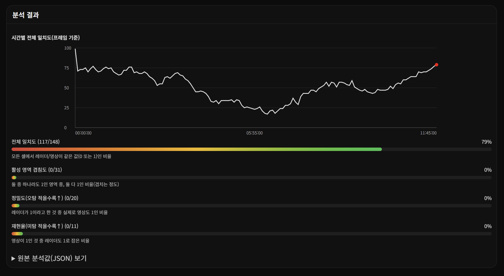

# WX Scrubber

> 레이더(CAT-08) · 기상 영상 · NC 데이터 기반 분석 도구

---

## 실행

```bash
npm run dev
```

---

## CAT 데이터 추출 (CAT-08)

### 화면 예시


### 기능
- AST 파일에서 **CAT-08 Weather Polar Vector** 추출

### 사용 순서
- 파일 선택
- **CAT8 추출 실행** 클릭

### 저장 정보

| 항목 | 내용 |
|---|---|
| 저장 경로 | `download/SSP/astjson/` |
| 저장 파일 | CAT-08 추출 JSON<br>원본 AST 파일 |

### 예시

| 구분 | 파일 |
|---|---|
| 입력 | `RDM_B2025122301.ast` |
| 출력 | `RDM_B2025122301.json`<br>`RDM_B2025122301.ast` |

---

## 기상데이터 추출 (이미지 기반)

### 화면 예시


### 기능
- 기상레이더 이미지를 시간 순서로 수집
- **MP4 영상 생성**

### 사용 순서
1. 메뉴 선택  
   `기상데이터 추출 → 이미지 기반 녹화`
2. 레이더 지점 선택
3. 날짜 선택
4. FPS 설정
5. **시작** 클릭
6. **중지 + MP4 생성**

### 출력 결과
- 기상레이더 이미지 프레임
- MP4 영상 파일

---

## 기상데이터 추출 (raw 파일 .nc 기반)

### 화면 예시


### 기능
- NC(raw) 파일 기반 **하루치 기상레이더 데이터 생성**

### 사용 순서
1. 날짜 선택 (하루 단위)
2. 자료 선택  
   - 예: `qcd (QC 적용)`
3. **NC 파일 1일치 생성 시작** 클릭
4. 다운로드 완료 후 미리보기 가능

### 출력 결과

| 항목 | 설명 |
|---|---|
| NC 파일 | 원본 데이터 |
| PNG | 렌더링 결과 |
| MP4 | 하루치 영상 |

---

## 최종 분석

### 기능
- CAT-08 레이더 데이터 ↔ 기상 영상 비교 분석

---

### 데이터 구성부


- RAW 데이터 시간 범위 표시 (KST)
- 레이더 / 영상 공통 사용 구간 계산
- 24시간 레이더 구성 요약
  - 파일 분할 정보
  - 패킷 재구성 정보

---

### 현시부


- CAT-08 레이더 재생
- 기상 영상 재생
- 프레임 단위 제어  
  (이전 / 재생 / 다음)
- 표시 모드
  - 원본
  - Grid
  - 오버레이

---

### 분석부



- 시간별 전체 일치도 그래프
- 분석 지표
  - 전체 일치도 비율
  - 활성 영역 겹침도
  - 정밀도
  - 재현율
- 원본 분석값(JSON) 확인 가능
