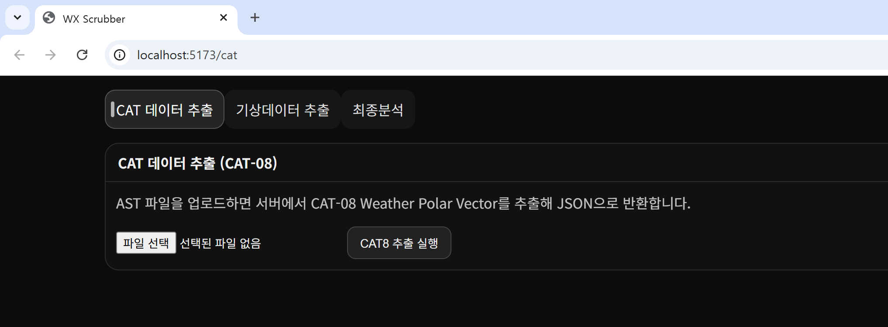
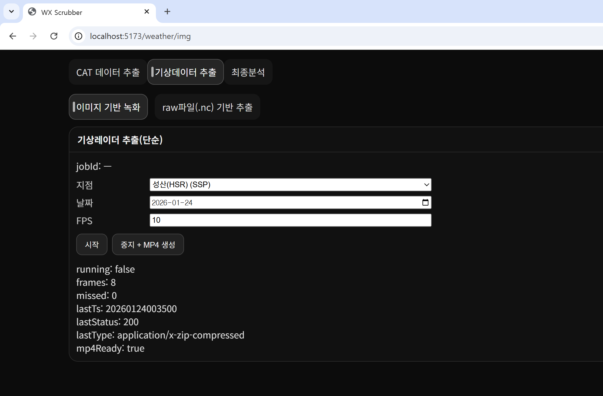
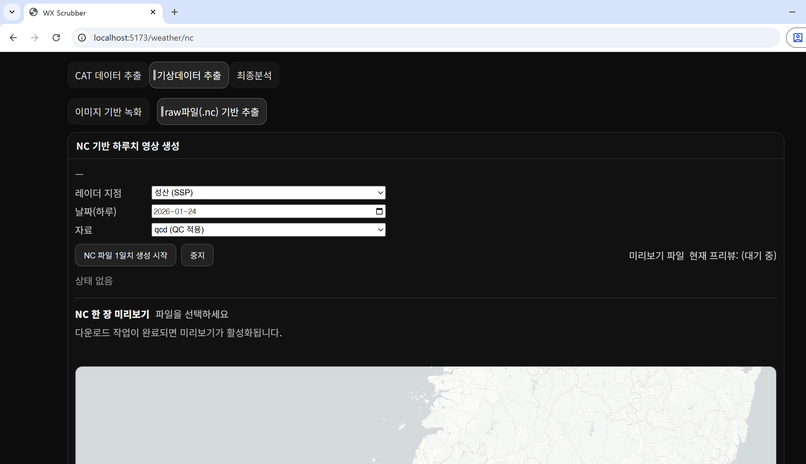
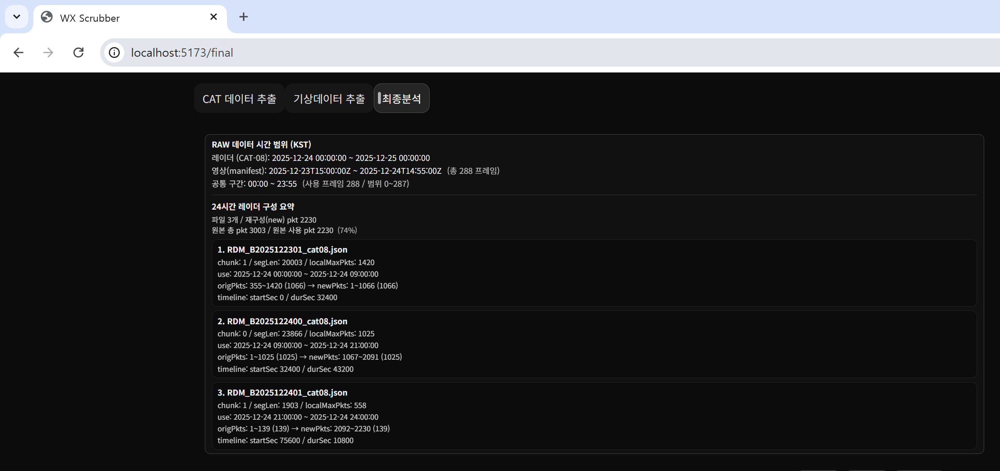
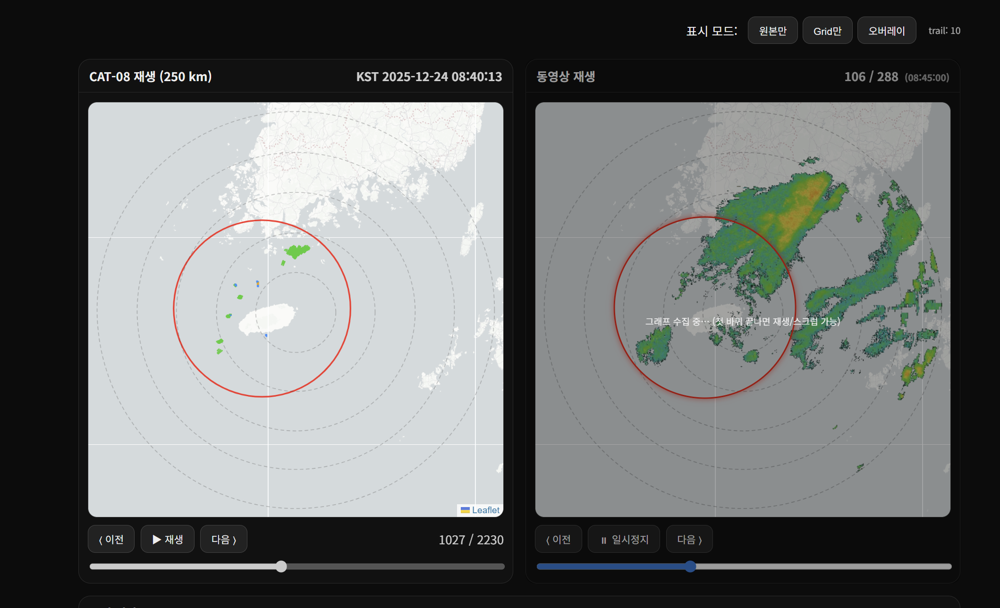

# WX Scrubber

> 레이더(CAT-08) · 기상 영상 · NC 데이터 기반 비교·분석 도구


## 환경 설정 (Environment Setup)

### 필수 실행 환경

- **Node.js**: v18 이상  
  - 프론트엔드/서버 실행용 (`npm run dev`)
- **Python**: 3.10 이상  
  - NC(.nc) 처리, 프레임 렌더링, manifest 생성 등 배치 스크립트 실행용
- **ffmpeg**: 시스템 설치 필요  
  - 프레임( PNG/WEBP ) → MP4 생성용

> ⚠️ `ffmpeg`는 Python 패키지가 아니므로 **OS에 직접 설치**되어 있어야 합니다.  
> 터미널에서 `ffmpeg -version` 으로 설치 여부를 확인할 수 있습니다.

### 설치 (권장 흐름)

```bash
# 1) Node 의존성
npm install

# 2) Python 가상환경 (예시)
python -m venv .venv
# macOS/Linux
source .venv/bin/activate
# Windows (PowerShell)
# .venv\Scripts\Activate.ps1

# 3) Python 의존성
pip install -r requirements.txt
```

---

## 프로젝트 개요 (Purpose & Value)

**WX Scrubber**는  
항공 레이더(CAT-08) 데이터와 기상 레이더 데이터를  
**동일한 시간 축 기준으로 정렬·재생·비교·분석**하기 위한 도구입니다.

관제 및 분석 환경에서는 다음과 같은 질문이 매우 중요합니다.

- 우리 레이더에 보이는 탐지 결과는 실제 항공기인가?
- 같은 시각, 실제 기상 상황은 어떠했는가?
- 기상으로 인한 오탐·미탐 가능성은 없는가?

하지만 CAT-08 레이더 데이터와 기상 데이터는  
형식, 시간 분해능, 표현 방식이 서로 달라  
직관적인 비교가 쉽지 않습니다.

WX Scrubber는 이러한 문제를 해결하기 위해  
두 데이터를 하나의 흐름으로 통합하여  
**시각적 + 정량적 분석이 가능하도록 설계되었습니다.**

---

## 우리가 이걸 왜 하느냐

WX Scrubber의 핵심 목적은 다음과 같습니다.

- 기상 상황이 레이더 탐지에 미치는 영향 확인
- 기상 영향으로 인한 레이더 이상 징후 인지
- 관제 시점 또는 사후 분석에서의 상황 재현
- 감각적 판단이 아닌 **수치 기반 비교·검증**

즉,

> “이 레이더 반응이 실제 대상인지,  
> 아니면 기상 영향에 의한 것인지”

를 **근거 있게 판단**할 수 있도록 돕는 것이 목적입니다.

---

## 기대 효과

- 관제·분석 인력의 상황 인지 정확도 향상
- 기상 영향 구간에 대한 사전/사후 분석 근거 확보
- 레이더 성능 및 필터링 로직 개선을 위한 데이터 제공
- 기상 조건별 레이더 반응 특성 이해

---

## 향후 발전 방향 (Short Roadmap)

- 장기 누적 데이터를 활용한 기상 유형별 패턴 분석
- 특정 기상 조건에서 레이더 이상 징후 자동 감지
- 관제 지원용 의사결정 보조 지표 개발
- 향후 머신러닝 기반 탐지 신뢰도 보정 모델 연계

---

## 실행

```bash
npm run dev
```

---

## CAT 데이터 추출 (CAT-08)

### 화면 예시


### 기능
- AST 파일에서 **CAT-08 Weather Polar Vector** 추출

### 사용 순서
- 파일 선택
- **CAT8 추출 실행** 클릭

### 저장 정보

| 항목 | 내용 |
|---|---|
| 저장 경로 | `download/SSP/astjson/` |
| 저장 파일 | CAT-08 추출 JSON<br>원본 AST 파일 |

### 예시

| 구분 | 파일 |
|---|---|
| 입력 | `RDM_B2025122301.ast` |
| 출력 | `RDM_B2025122301.json`<br>`RDM_B2025122301.ast` |

---

## 기상데이터 추출 (이미지 기반)

### 화면 예시


### 기능
- 기상레이더 이미지를 시간 순서로 수집
- **MP4 영상 생성**

### 사용 순서
1. 메뉴 선택  
   `기상데이터 추출 → 이미지 기반 녹화`
2. 레이더 지점 선택
3. 날짜 선택
4. FPS 설정
5. **시작** 클릭
6. **중지 + MP4 생성**

### 출력 결과
- 기상레이더 이미지 프레임
- MP4 영상 파일

---

## 기상데이터 추출 (raw 파일 .nc 기반)

### 화면 예시


### 기능
- NC(raw) 파일 기반 **하루치 기상레이더 데이터 생성**

### 사용 순서
1. 날짜 선택 (하루 단위)
2. 자료 선택  
   - 예: `qcd (QC 적용)`
3. **NC 파일 1일치 생성 시작** 클릭
4. 다운로드 완료 후 미리보기 가능

### 출력 결과

| 항목 | 설명 |
|---|---|
| NC 파일 | 원본 데이터 |
| PNG | 렌더링 결과 |
| MP4 | 하루치 영상 |

---

## 최종 분석

### 기능
- CAT-08 레이더 데이터 ↔ 기상 영상 비교 분석

---

### 데이터 구성부



- RAW 데이터 시간 범위 표시 (KST)
- 레이더 / 영상 공통 사용 구간 계산
- 24시간 레이더 구성 요약
  - 파일 분할 정보
  - 패킷 재구성 정보

---

### 현시부



- CAT-08 레이더 재생
- 기상 영상 재생
- 프레임 단위 제어  
  (이전 / 재생 / 다음)
- 표시 모드
  - 원본
  - Grid
  - 오버레이

---

## 분석 결과의 의미 (분석부 설명)

WX Scrubber의 분석부는  
**같은 시간, 같은 공간에서 두 데이터가 얼마나 유사한지**를  
이해하기 쉬운 지표로 제공합니다.

### 분석 기준
- 동일 시간대 프레임 기준
- CAT-08 레이더 탐지 결과와 기상 데이터 비교

---

### 분석 지표 설명

#### 전체 일치도 비율
- 전체 영역 기준으로 두 데이터의 유사도
- 높을수록 레이더 탐지 결과가 기상 데이터와 전반적으로 일치
- **개념식:** `공통으로 일치하는 영역 / 전체 비교 영역`

#### 활성 영역 겹침도
- 실제 의미 있는 탐지 영역만을 기준으로 한 겹침 정도
- 빈 영역의 영향 최소화
- **개념식:** `CAT-08 ∩ 기상청 / (CAT-08 ∪ 기상청)`

#### 정밀도 (Precision)
- 레이더가 탐지한 것 중 실제 기상 데이터에도 존재한 비율
- 오탐(false positive)이 얼마나 적은지를 의미
- **개념식:** `CAT-08 ∩ 기상청 / CAT-08`

#### 재현율 (Recall)
- 기상 데이터에 존재하는 현상 중 레이더가 탐지한 비율
- 미탐(false negative)이 얼마나 적은지를 의미
- **개념식:** `CAT-08 ∩ 기상청 / 기상청`

---

### 이 분석을 통해 알 수 있는 것

- 기상 영향으로 레이더가 과민 반응했는지 여부
- 중요한 기상 신호를 놓친 구간 존재 여부
- 시간대별 레이더 신뢰도 변화
- 단순 시각 비교를 넘어선 정량적 판단 근거 확보
